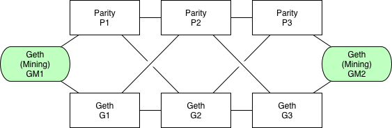

ECIP-1017 (Monetary Policy) Testing tool
========================================

# Project Idea

ECIP-1017 https://github.com/ethereumproject/ECIPs/blob/master/ECIPs/ECIP-1017.md

Emulate a lifecycle of a network of ETC nodes through few monetary supply eras and verify that network works as expected without interruptions and produces correct reward.

# Implementation

## Network

Run a network in a Google Cloud with Kubernetes. That allows to run testing by any 3rd party, it takes minutes to setup Google Cloud account and should cost less that a $100 for the full testing scenario. With current configuration it takes about 2 hours to get first results.

Preconfigured network topology to cover most of real life edges:

 * Geth-Geth, Parity-Parity, Geth-Parity
 * 2 mining nodes at ends
 * loose connection between peers



You can drop any of the nodes during the test (`kubectl delete pod ....`) or make any other manual experiments. The network can easily get forked after that and both mining nodes will start following own fork and competing for a longer chain. Maybe it's not very desirable, but it's a normal behaviour. You can fix this by killing forked parts of the network.

## Running

### Requirements

Ensure you've got at least Python 3.5 and have `pip` installed, then install the project's python dependencies.
```
⟠ pip --version
pip 9.0.1 from /Users/ia/Envs/dfs/lib/python3.5/site-packages (python 3.5)
⟠ pip install -r ./bin/requirements.txt
```

Lastly, you'll need to install the Google Cloud SDK command line tool, available
here https://cloud.google.com/sdk/. For a general walkthrough of what the following setup
steps (eg install and authorization), see ./setup-howto.md.

### Docker containers

All images are already prepared and deployed to Docker Hub registry. If you want to use custom modification then the most simple way would be to deploy your custom images directly to Google Cloud Containers registry, you'll need to update the names in `k18s/*.rc.yaml` and use `bin/build.sh`.

To use existing containers you don't need to do anything, just deploy as-is and see status/verify.

### Google Cloud

Setup a new cluster on Google Cloud with at least 8 nodes. Standard VM type n1-standard-1 works perfectly for that demo, you can try a smaller VM if you wish.
Otherwise, default configurations as provided on the Google GUI will be fine.

### Deploy

Run
```
bin/deploy.sh <GOOGLE_CLOUD_ID> <GOOGLE_ZONE_ID> <GOOGLE_CLUSTER_ID>
```

For example if you have a google project `etctests` and created a GCK cluster `ecip1017` with 8 nodes, run following:
```
bin/deploy.sh etctests us-east1-b ecip1017
```

### Check status

```
./bin/status.py
```

Sample output:
```
$ ./bin/status.py
Nodes status
ID			PEERS	HEIGHT	HASH
node-g1-rc-ssxzw	3	505	0x97e922fd8645b75fa3ba2ec796e153b8be8c0ac90b9778f2d1b880b32d4abad6
node-g2-rc-l1hm4	4	505	0x97e922fd8645b75fa3ba2ec796e153b8be8c0ac90b9778f2d1b880b32d4abad6
node-g3-rc-lrshk	3	505	0x97e922fd8645b75fa3ba2ec796e153b8be8c0ac90b9778f2d1b880b32d4abad6
node-gm1-rc-jff49	2	505	0x97e922fd8645b75fa3ba2ec796e153b8be8c0ac90b9778f2d1b880b32d4abad6
node-gm2-rc-3gjwn	2	503	0x6ba0cbc541e3bd7fade862fa8a755224685d80eab6629308d13b26110ebd6325
node-p1-rc-jjgz7	2	505	0x97e922fd8645b75fa3ba2ec796e153b8be8c0ac90b9778f2d1b880b32d4abad6
node-p2-rc-83dpb	2	505	0x97e922fd8645b75fa3ba2ec796e153b8be8c0ac90b9778f2d1b880b32d4abad6
node-p3-rc-czr67	2	505	0x97e922fd8645b75fa3ba2ec796e153b8be8c0ac90b9778f2d1b880b32d4abad6
Checking for a fork...
Ok. No Fork detected

Last safe block:
ID			HEIGHT	HASH
node-g1-rc-ssxzw	493	0x446641becf5b863ce41aea520c524137152e0a30a6442fe32a3dbe7537c6d9fc
node-g2-rc-l1hm4	493	0x446641becf5b863ce41aea520c524137152e0a30a6442fe32a3dbe7537c6d9fc
node-g3-rc-lrshk	493	0x446641becf5b863ce41aea520c524137152e0a30a6442fe32a3dbe7537c6d9fc
node-gm1-rc-jff49	493	0x446641becf5b863ce41aea520c524137152e0a30a6442fe32a3dbe7537c6d9fc
node-gm2-rc-3gjwn	493	0x446641becf5b863ce41aea520c524137152e0a30a6442fe32a3dbe7537c6d9fc
node-p1-rc-jjgz7	493	0x446641becf5b863ce41aea520c524137152e0a30a6442fe32a3dbe7537c6d9fc
node-p2-rc-83dpb	493	0x446641becf5b863ce41aea520c524137152e0a30a6442fe32a3dbe7537c6d9fc
node-p3-rc-czr67	493	0x446641becf5b863ce41aea520c524137152e0a30a6442fe32a3dbe7537c6d9fc

Blockchain head block (nodes could have different head block):
ID			HEIGHT	HASH
node-g1-rc-ssxzw	503	0x6ba0cbc541e3bd7fade862fa8a755224685d80eab6629308d13b26110ebd6325
node-g2-rc-l1hm4	503	0x6ba0cbc541e3bd7fade862fa8a755224685d80eab6629308d13b26110ebd6325
node-g3-rc-lrshk	503	0x6ba0cbc541e3bd7fade862fa8a755224685d80eab6629308d13b26110ebd6325
node-gm1-rc-jff49	503	0x6ba0cbc541e3bd7fade862fa8a755224685d80eab6629308d13b26110ebd6325
node-gm2-rc-3gjwn	503	0x6ba0cbc541e3bd7fade862fa8a755224685d80eab6629308d13b26110ebd6325
node-p1-rc-jjgz7	503	0x6ba0cbc541e3bd7fade862fa8a755224685d80eab6629308d13b26110ebd6325
node-p2-rc-83dpb	503	0x6ba0cbc541e3bd7fade862fa8a755224685d80eab6629308d13b26110ebd6325
node-p3-rc-czr67	503	0x6ba0cbc541e3bd7fade862fa8a755224685d80eab6629308d13b26110ebd6325
```

### Verify state

```
./bin/verify.py
```


Sample output:
```
$ ./bin/verify.py
Verify blockchain state....
-------------------------------------------
Download blockchain for local analysis.... (blocks 1..507, it may take 5+ minutes)
Done
-------------------------------------------
-------------------------------------------
Mining stats:
  Miner 0x895b2a4a1beffc42f0eb28fb9be9d8d4478c011f made 347 blocks
  Miner 0x479f3307a0e40a8cd8b772e17ec9f809e0dd03ad made 160 blocks
  Miner 0x895b2a4a1beffc42f0eb28fb9be9d8d4478c011f found 21 uncles
  Miner 0x479f3307a0e40a8cd8b772e17ec9f809e0dd03ad found 15 uncles
  Miner 0x895b2a4a1beffc42f0eb28fb9be9d8d4478c011f made 13 uncles
  Miner 0x479f3307a0e40a8cd8b772e17ec9f809e0dd03ad made 23 uncles
-------------------------------------------
Expected state:
  Miner 0x895b2a4a1beffc42f0eb28fb9be9d8d4478c011f should have 1783781250000000000000
  Miner 0x479f3307a0e40a8cd8b772e17ec9f809e0dd03ad should have 889218750000000000000
-------------------------------------------
-------------------------------------------
Verifying...
  OK. Blockchain has a valid state
-------------------------------------------
```


